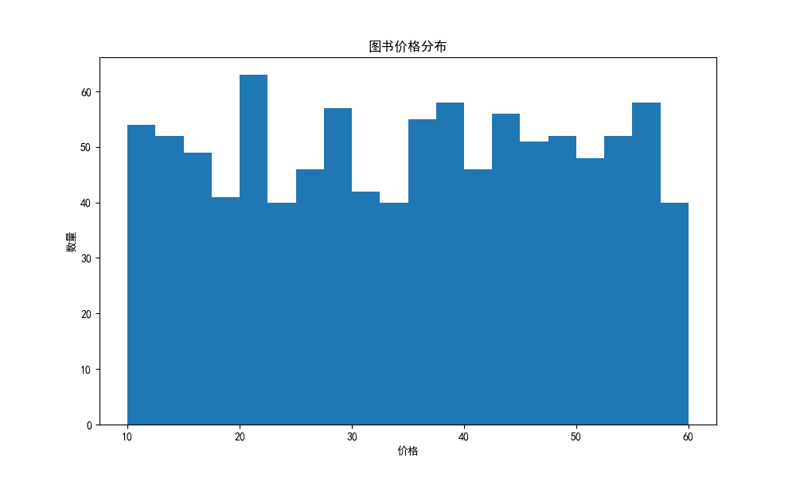
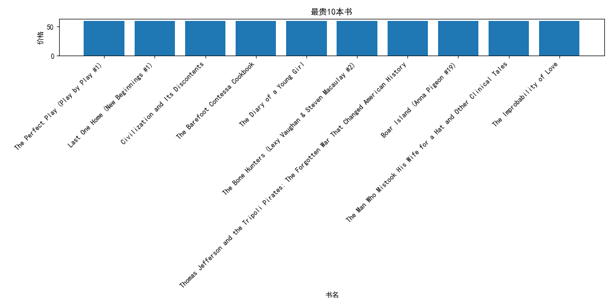
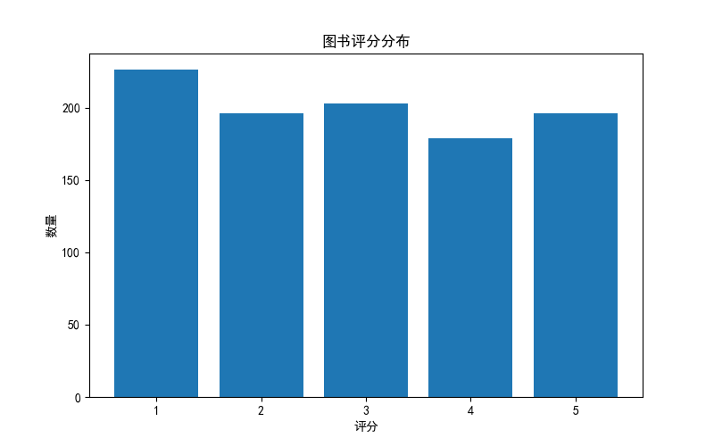

# 图书数据爬虫与分析项目

## 项目简介

本项目通过 Python 爬虫技术从 Books to Scrape 网站采集图书数据，并利用 Pandas 进行数据清洗与分析，最终使用 Matplotlib 进行可视化展示。

项目实现了从数据获取、数据处理到数据分析的完整流程，适合作为 Python 数据分析与爬虫学习项目。

---

## 项目目标

- 爬取网站图书信息
- 获取图书名称、价格、评分等数据
- 数据清洗与转换
- 数据统计分析
- 数据可视化展示

---

## 技术栈

- Python
- Requests
- BeautifulSoup4
- Pandas
- Matplotlib
- Git
- GitHub

---

## 项目结构

```text
movie_analysis_project/
│
├── data/
│   └── books.csv
│
├── spider.py
├── analysis.py
│
├── price_distribution.png
├── top10_expensive_books.png
├── star_rating_distribution.png
│
├── requirements.txt
└── README.md
```

---

## 数据采集

通过 Requests 获取网页内容：

```python
response = requests.get(url)
```

使用 BeautifulSoup 解析 HTML：

```python
soup = BeautifulSoup(response.text, "html.parser")
```

循环爬取网站全部 50 页数据，共获取约 1000 条图书记录。

---

## 数据清洗

主要完成：

- 删除价格中的货币符号
- 数据类型转换
- 缺失值检查
- 数据格式标准化

示例：

```python
df["价格"] = (
    df["价格"]
    .str.replace("£", "")
    .astype(float)
)
```

---

## 数据分析内容

### 1. 图书价格统计分析

统计：

- 平均价格
- 最大价格
- 最小价格
- 价格分布情况

### 2. 最贵图书分析

筛选价格最高的前10本图书。

### 3. 图书评分分析

统计：

- 一星图书数量
- 二星图书数量
- 三星图书数量
- 四星图书数量
- 五星图书数量

---

## 可视化结果

### 图书价格分布



### 最贵10本图书



### 图书评分分布



---

## 项目收获

通过本项目掌握了：

- Python网络爬虫基础
- Requests库使用
- BeautifulSoup网页解析
- Pandas数据分析
- Matplotlib数据可视化
- Git版本管理
- GitHub项目管理

---

## Rr

GitHub：
https://github.com/Rr-102488